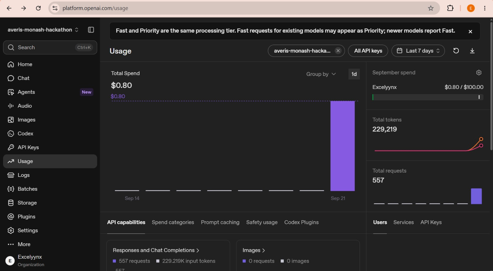

# SDOC

**Adaptive, explainable shipping-document verification for high-volume operations.**

SDOC processes an entire email inbox (520-email challenge bundle), classifies each message, identifies Shipping Instruction (SI) and Bill of Lading (BL) documents, compares seven business-critical fields, and routes uncertain cases to human review.

## Problem and Solution

Shipping teams receive high volumes of emails and documents in inconsistent formats. Manually deciding which messages matter, finding the correct SI/BL pair, and checking every field is slow and error-prone. A fully generative solution creates a different risk: plausible answers without traceable evidence.

SDOC uses a **deterministic-first pipeline with selective AI fallback**. Rules resolve known evidence, AI handles only uncertain classifications, roles, or missing fields, and deterministic validation always produces the final status. Operators can inspect the evidence, correct results, manage learned knowledge, and export a schema-valid submission.

## Success Metrics

| Measure                                 |                                       Result |
| --------------------------------------- | -------------------------------------------: |
| Challenge output coverage               |                  520/520 email IDs validated |
| Automated tests                         |                                75/75 passing |
| Labelled classification development set |                  15/15 correct; macro-F1 1.0 |
| Supported attachment formats            |                         TXT, PDF, DOCX, XLSX |
| Observed AI development usage           | $0.80 for 229,219 tokens across 557 requests |

The labelled set is small and intentionally unambiguous, so it is evidence of correctness—not a claim of production accuracy.

## Technical Architecture

```text
[React operations dashboard]
            |
            v
[Express API: runs, inbox, review, knowledge, metrics]
            |
            v
[Safe ingestion] -> [Email classification] -> [Document parsing]
                                              TXT / PDF / DOCX / XLSX
                                                        |
                                                        v
                         [SI/BL role detection] -> [7-field extraction]
                                                        |
                                                        v
                           [Normalization] -> [Deterministic comparison]
                                                        |
                                                        v
                                      OK / MISMATCH / NEEDS_REVIEW

Uncertain classification, role, or field
            |
            v
[Structured OpenAI fallback] -> [Evidence validation] -> [AI cache]
            |
            +---------------------------> resume deterministic pipeline

[MongoDB] persists runs, emails, results, reviews, knowledge and audit events.
```

| Layer      | Technology                    | Responsibility                                                          |
| ---------- | ----------------------------- | ----------------------------------------------------------------------- |
| Frontend   | React 19, Vite, Tailwind CSS  | Run monitoring, evidence inspection, review, knowledge controls, export |
| API        | Node.js 24, Express 5, Zod    | Orchestration, validation, security boundaries, metrics                 |
| Data       | MongoDB, Mongoose             | Durable processing state, reviews, AI cache, knowledge, audit history   |
| AI         | OpenAI Responses API          | Structured fallback for unresolved work only                            |
| Deployment | Docker, MongoDB Atlas, Render | Reproducible single-service cloud deployment                            |

## Implementation Details

- **Adaptive classification:** weighted subject/body phrase scoring uses confidence and margin gates. Low-confidence messages use structured AI output, and returned evidence must appear verbatim in the source.
- **Multi-format processing:** dedicated parsers preserve line, page, paragraph/table, or sheet/cell locations. File signatures are checked separately from extensions, and corrupt, scanned, encrypted, or unsupported inputs remain distinguishable.
- **Document verification:** rules identify SI/BL roles and extract `shipper`, `consignee`, `notify_party`, `port_of_loading`, `port_of_discharge`, `container_count`, and `gross_weight_kg`. Field-specific normalization enables deterministic comparison.
- **Human review:** unresolved cases enter a stage-specific queue. Reviewers preview corrections, retry processing, reopen cases, and retain an audit history without modifying source files.
- **Safe learning:** accepted evidence starts in low-weight probation. Generic, sensitive, shipment-specific, or conflicting phrases are rejected; learned entries can be blocked or retired.
- **Operational controls:** runs are asynchronous, concurrency-bounded, cancellable, retryable, and versioned. Submission export enforces exact, duplicate-free ID coverage.

## AI and Cloud Infrastructure Integration

AI is a bounded component, not the decision-maker. SDOC sends only unresolved work to the OpenAI Responses API, requires strict schemas, verifies textual evidence, and caches results by source hash, purpose, model, prompt, schema, and requested fields. If AI is unavailable or evidence cannot be verified, the case fails safely into review.

MongoDB Atlas stores durable application state. The production Docker image builds the React client and serves it with the Express API from one Render service; secrets remain server-side and the filesystem stays disposable.

<details>
<summary><strong>Observed API usage and scale reference</strong></summary>



The captured development window averages about **412 tokens** and **$0.00144 per request**. At the same request mix, 100,000 requests would cost approximately **$143.63**, and one million approximately **$1,436.27**.

These are linear illustrations, not production guarantees. Model mix, caching, retries, document complexity, and provider pricing can change the result. See the [official OpenAI model pricing](https://developers.openai.com/api/docs/models/gpt-5.5).

</details>

## User Feedback and Testing

The interface was iterated around the operator's core tasks: start a run, identify exceptions, inspect evidence, correct a decision, and export the result. Explainability, review previews, status filters, and visible metrics were prioritized so users do not need to trust a black box.

Validation currently includes:

- 75 automated tests across contracts, parsers, AI failure handling, review safety, security, metrics, and representative end-to-end cases.
- A 15-case manually labelled classification development set covering all five categories.
- Independent validation of all 520 required output IDs.
- Production client builds and repeatable Docker deployment checks.

Formal external usability testing has not yet been completed. That is a roadmap item; the current feedback loop is task-based team walkthroughs plus automated and dataset-level verification.

## Challenges Faced

| Coding challenge                                                          | Resolution                                                                     |
| ------------------------------------------------------------------------- | ------------------------------------------------------------------------------ |
| The same field appears in very different document structures              | Format-specific parsers preserve native evidence locations                     |
| AI can return plausible but unsupported values                            | Strict schemas, verbatim evidence checks, and deterministic final decisions    |
| Automatic learning can amplify poor phrases                               | Probation weights, promotion thresholds, conflict tracking, and moderation     |
| Parallel runs and retries can create incomplete or duplicate output       | Stable IDs, idempotent persistence, run versioning, and independent validation |
| Scanned or damaged documents cannot be safely verified from embedded text | Explicit `NEEDS_REVIEW` outcomes instead of silent guesses                     |

## Future Roadmap

1. **Scale processing:** move runs to durable queue workers with leases, resumable jobs, idempotency keys, and horizontal autoscaling.
2. **Improve document coverage:** add OCR for scanned PDFs/images while preserving page-level evidence.
3. **Improve generalization:** replace exact long-phrase learning with bounded semantic concepts and validate against a larger held-out dataset.
4. **Add enterprise controls:** implement authentication, role-based access, organization isolation, SSO, and retention policies.
5. **Connect live workflows:** ingest from Microsoft 365 or Gmail and export approved results to ERP/TMS platforms.
6. **Continuously optimize:** monitor drift, extraction accuracy, review rate, latency, and cost; route simpler fallbacks to smaller models where quality permits.

## Quick Start

Requirements: Git, Docker Desktop or Docker Engine with Compose, a reachable MongoDB database, and an optional OpenAI API key.

```sh
git clone https://github.com/excelyynxl-a11y/fn-key.git
cd fn-key
```

Create `.env` in the repository root:

```dotenv
MONGO_URI=mongodb+srv://<user>:<password>@<cluster>/<database>
OPENAI_API_KEY=
OPENAI_MODEL=gpt-5.5
```

Start the application:

```sh
docker compose up --build
```

- Frontend: http://localhost:5173
- API: http://localhost:5000/api
- Health check: http://localhost:5000/health

Run verification locally:

```sh
cd server
npm test
npm run evaluate:classification
cd ../client
npm run build
```

The root [`Dockerfile`](Dockerfile) is the production image for a single Render service. Set `MONGO_URI`, `CLIENT_ORIGIN`, `OPENAI_API_KEY`, and `OPENAI_MODEL`; use `/health` as the health-check path.

## Current Limitations

- Exact learned phrase matching does not yet generalize well to substantially reworded external datasets.
- Scanned documents require review until OCR is added.
- Authentication, live email ingestion, and distributed background workers remain future work.
